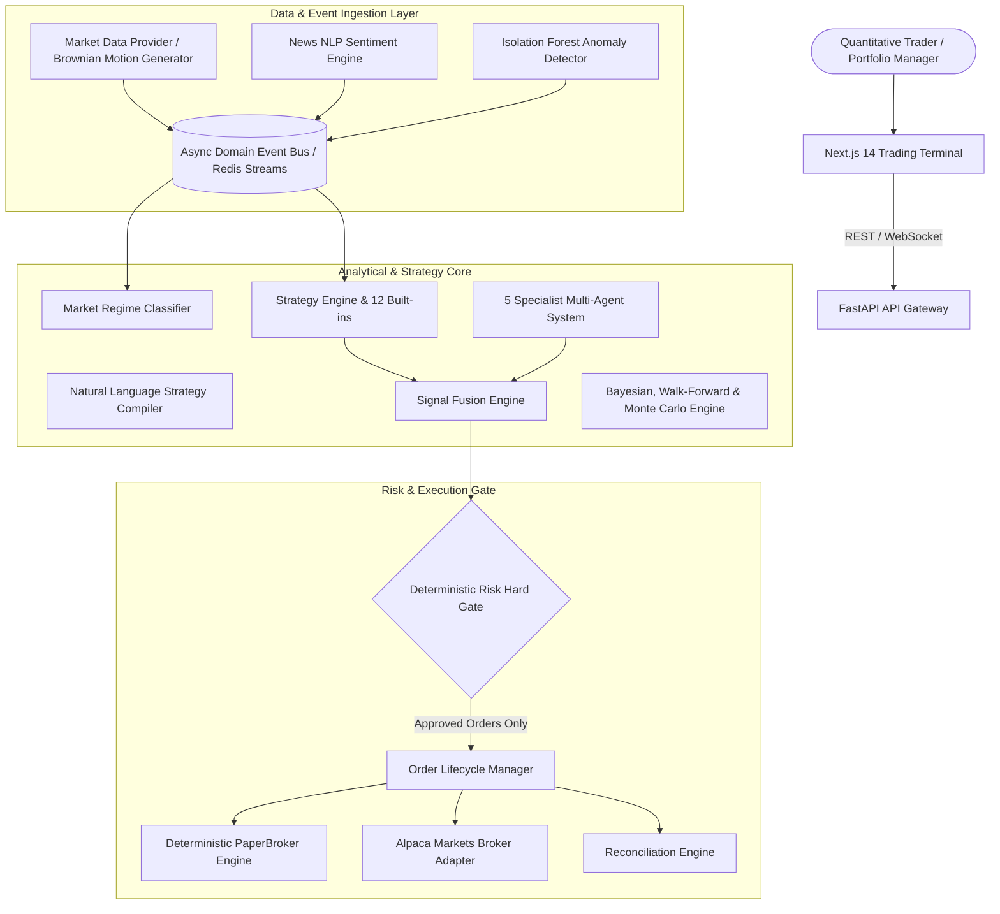

# QUANTARA — AI Quantitative Trading & Research Platform

<div align="center">

```
   ____  __  _____    _   ________________    ____  ___ 
  / __ \/ / / /   |  / | / /_  __/   / __ \  /   | /   |
 / / / / / / / /| | /  |/ / / / / /| | /_/ / / /| |/ /| |
/ /_/ / /_/ / ___ |/ /|  / / / / ___ | _, _// ___ / ___ |
\___\_\____/_/  |_/_/ |_/ /_/ /_/  |_/_/ |_/_/  |/_/  |_|
```

**Institutional-Grade Event-Driven Quantitative Trading, Multi-Agent AI Research & Deterministic Execution Terminal**

[](docs/ARCHITECTURE.md)
[](https://python.org)
[](https://fastapi.tiangolo.com)
[](https://nextjs.org)
[](https://render.com)
[](LICENSE)

</div>

---

## 📑 Table of Contents

1. [Executive Summary & Product Vision](#1-executive-summary--product-vision)
2. [Core Architecture & Event Bus](#2-core-architecture--event-bus)
3. [Monorepo Directory Structure](#3-monorepo-directory-structure)
4. [Quantitative Engine Stack](#4-quantitative-engine-stack)
   - [Event-Driven Backtest Engine](#event-driven-backtest-engine)
   - [Walk-Forward Validation Engine (WFE)](#walk-forward-validation-engine-wfe)
   - [Monte Carlo Simulation Engine](#monte-carlo-simulation-engine)
   - [Market Regime Detection Engine](#market-regime-detection-engine)
   - [Signal Fusion Engine](#signal-fusion-engine)
   - [Portfolio Optimizer (Markowitz & Risk Parity)](#portfolio-optimizer-markowitz--risk-parity)
5. [AI Multi-Agent Financial Research System](#5-ai-multi-agent-financial-research-system)
6. [Natural Language Strategy Compiler & DSL](#6-natural-language-strategy-compiler--dsl)
7. [Pre-Trade Risk Hard Gate & Position Sizing](#7-pre-trade-risk-hard-gate--position-sizing)
8. [Broker Abstraction & Paper Trading Simulator](#8-broker-abstraction--paper-trading-simulator)
9. [Next.js Institutional Trading Terminal UI](#9-nextjs-institutional-trading-terminal-ui)
10. [REST & WebSocket API Reference](#10-rest--websocket-api-reference)
11. [Quickstart & Local Development](#11-quickstart--local-development)
12. [One-Click Cloud Deployment (Render.com)](#12-one-click-cloud-deployment-rendercom)
13. [Testing & Verification](#13-testing--verification)
14. [Security & Compliance](#14-security--compliance)

---

## 1. Executive Summary & Product Vision

**QUANTARA** is an advanced quantitative algorithmic trading, multi-agent financial research, and deterministic execution platform. It replaces generic AI chatbot stock predictions with an institutional, mathematically grounded system emphasizing:

- **Deterministic Execution**: Given historical data and parameters, every backtest and signal calculation is 100% reproducible.
- **Zero Look-Ahead Bias & Zero Leakage**: Event-driven backtesting feeds candles strictly chronologically without future data contamination.
- **Pre-Trade Risk Hard Gate**: AI agents generate research and signal proposals, but **cannot bypass deterministic risk limits** (max single-asset exposure, leverage caps, daily loss limits, drawdown circuit breakers).
- **Multi-Agent Research Synthesis**: 5 autonomous specialist agents (*Market, Fundamental, Sentiment, Quant, Risk*) collaborate to generate transparent, explainable trade theses with actionable entry, target, and stop-loss levels.
- **Natural Language Strategy Synthesis**: Converts natural language queries into validated JSON AST Strategy DSL specifications.
- **Zero External Dependency Mode**: Ships out of the box with a Geometric Brownian Motion stochastic market data generator and built-in `PaperBroker` matching engine.

---

## 2. Core Architecture & Event Bus

Quantara operates on an **asynchronous event-driven architecture** isolating domain logic from framework abstractions.



---

## 3. Monorepo Directory Structure

```
quantara/
├── apps/
│   ├── web/                     # Next.js 14+ / TypeScript Quantitative Terminal Frontend
│   │   ├── src/app/             # 15+ Trading Terminal Routes
│   │   ├── src/components/      # TradingViewChart, Sidebar, Navbar, CommandPalette, Widgets
│   │   └── src/lib/             # Typed API Client & Zustand Store
│   └── api/                     # FastAPI Backend API Gateway & WebSocket Server
│       ├── main.py              # Application lifecycle & WebSocket manager
│       ├── auth.py              # JWT Authentication & RBAC
│       └── routers/             # 15 REST Domain Routers
│
├── services/                    # Domain Service Modules & Background Workers
│   ├── market_data/             # Provider-agnostic feeds & synthetic Brownian motion
│   ├── strategy_engine/         # Strategy lifecycle, DSL validator, NL compiler
│   ├── backtest_engine/         # Event-driven backtesting & metrics
│   ├── optimization_engine/     # Bayesian, Walk-Forward, Monte Carlo (10k runs)
│   ├── portfolio_engine/        # Markowitz Max Sharpe & Risk Parity optimizers
│   ├── risk_engine/             # Pre-trade risk hard-gate & circuit breakers
│   ├── signal_engine/           # Signal fusion (Tech + Fund + Sent + ML + Regime)
│   ├── ai_engine/               # Multi-agent financial research & Copilot
│   ├── news_engine/             # News ingestion, NLP sentiment & impact rating
│   ├── anomaly_engine/          # Isolation Forest & Z-score anomaly detector
│   ├── execution_engine/        # Idempotent order lifecycle & broker router
│   ├── reconciliation_engine/   # Internal vs broker position/cash auditor
│   └── notification_engine/     # Multi-channel alert dispatcher
│
├── packages/                    # Pure Domain Libraries & Math Core
│   ├── domain/                  # Pydantic core models, enums & entity schemas
│   ├── events/                  # Typed CloudEvents & EventBus with idempotency
│   ├── indicators/              # Vectorized technical indicators (RSI, EMA, MACD, etc.)
│   ├── strategies/              # 12+ built-in quantitative trading strategies
│   ├── brokers/                 # Broker abstraction & PaperBroker simulator
│   ├── risk/                    # Position sizing models & rule definitions
│   ├── backtesting/             # Deterministic event-driven simulation core
│   ├── portfolio/               # Covariance & asset allocation algorithms
│   ├── ml/                      # Market regime models & time-series feature pipeline
│   ├── validation/              # Data quality checkers & schema validators
│   └── shared/                  # Utilities & AES-GCM credential vault
│
├── database/                    # PostgreSQL / TimescaleDB & SQLite Fallback
│   ├── connection.py            # Async engine & session factory
│   ├── schemas/                 # SQLAlchemy 2.0 ORM models
│   └── seeds/                   # Rich demo seed script (users, instruments, strategies)
│
├── infrastructure/              # Dockerfiles, docker-compose.yml, Prometheus configs
├── scripts/                     # dev.sh, test.sh, seed.sh, reset.sh (.bat for Windows)
├── tests/                       # Full Unit, Integration, Determinism & Risk Tests
├── docs/                        # Complete architecture, SDK, API, & deployment guides
├── render.yaml                  # Render.com Blueprint Infrastructure-as-Code
└── README.md                    # Master platform documentation
```

---

## 4. Quantitative Engine Stack

### Event-Driven Backtest Engine
- Strictly iterates over chronological candlestick series bar-by-bar.
- Simulates tick-level slippage (configurable bps), commissions ($0.005/share), and order types (Market, Limit, Stop).
- Computes complete quantitative metrics: Total Return, CAGR, Sharpe Ratio, Sortino Ratio, Calmar Ratio, Maximum Drawdown %, Win Rate, Profit Factor, Expectancy, Recovery Factor, Annualized Volatility, Value at Risk (VaR 95%), Conditional VaR (CVaR 95%), and Monthly Returns Heatmap matrix.
- Produces unique **Reproducibility Hashes** (SHA-256) for auditability.

### Walk-Forward Validation Engine (WFE)
- Enforces chronological in-sample (IS) vs. out-of-sample (OOS) rolling train/test splits.
- Calculates **Walk-Forward Efficiency (WFE)**:
  $$\text{WFE} = \frac{\text{Mean Out-of-Sample Sharpe}}{\text{Mean In-Sample Sharpe}}$$
- Flags overfitting and curve-fitting when $\text{WFE} < 0.55$.

### Monte Carlo Simulation Engine
- Bootstraps historical trade return series across 1,000 to 10,000 randomized iterations.
- Outputs Drawdown Confidence Intervals (5%, 50%, 95%), Probability of Profit, Probability of Ruin (50% capital drawdown), Median Ending Equity, and Sample Equity Paths.

### Market Regime Detection Engine
Classifies the market environment into 8 distinct regimes:
- `BULL`: Price $> \text{SMA}_{20} > \text{SMA}_{50}$, positive 20-day returns, expanding ADX.
- `BEAR`: Price $< \text{SMA}_{50}$, negative slope, declining momentum.
- `SIDEWAYS`: ADX $< 20$, price oscillating around flat moving averages.
- `HIGH_VOLATILITY`: Annualized volatility $> 32\%$, wide ATR bands.
- `LOW_VOLATILITY`: Volatility $< 12\%$, ATR $< 1.2\%$.
- `BREAKOUT`: Price exceeds 20-day high/low with Volume Z-score $> 2.0$.
- `PANIC`: 5-day drop $> 7\%$ with volatility burst and volume spike.
- `RECOVERY`: Oversold RSI rebound with positive 5-day momentum.

### Signal Fusion Engine
Synthesizes 5 multi-modal factor scores with strict weight normalization:
$$\text{Total Score} = w_{\text{tech}} S_{\text{tech}} + w_{\text{fund}} S_{\text{fund}} + w_{\text{sent}} S_{\text{sent}} + w_{\text{quant}} S_{\text{quant}} + w_{\text{regime}} S_{\text{regime}} - \text{Risk Penalty}$$
Outputs clear reason codes (e.g., `PRICE_ABOVE_50_SMA`, `RSI_HEALTHY_MOMENTUM`) and risk penalties.

### Portfolio Optimizer (Markowitz & Risk Parity)
- **Markowitz Maximum Sharpe Ratio**: Tangency portfolio maximizing risk-adjusted return using annualized covariance matrix inversion.
- **Equal Risk Contribution (Risk Parity)**: Iterative numerical optimization allocating capital such that each asset contributes equally to total portfolio variance.
- **Minimum Global Variance**: Long-only quadratic minimization of portfolio variance.
- **Equal Weight (1/N)**: Balanced baseline allocation.

---

## 5. AI Multi-Agent Financial Research System

Quantara deploys **5 specialized autonomous research sub-agents** orchestrated by a master synthesizer:

| Agent | Responsibility | Key Indicators & Features |
|---|---|---|
| **Market Analyst** | Technical structure & momentum | Multi-timeframe SMAs/EMAs, RSI(14), ADX trend strength, VWAP |
| **Fundamental Analyst** | Balance sheet & valuation quality | P/E ratio, P/S ratio, YoY Revenue Growth, Net Profit Margins, Debt/Equity |
| **Sentiment Analyst** | Media narrative & market sentiment | NLP sentiment classification, media volume Z-scores, news impact ranking |
| **Quant Analyst** | Factor exposures & regime statistics | Rolling beta, statistical volatility, factor momentum rank, regime alignment |
| **Risk Analyst** | Downside protection & tail risk | Value at Risk (VaR 95%), liquidity depth, ATR stop-loss distance |
| **Research Synthesizer** | Aggregation & actionable thesis | Unified conviction score, actionable Entry, Target, and Stop-Loss levels |

---

## 6. Natural Language Strategy Compiler & DSL

Quantara translates plain English trading rules into validated JSON AST Strategy DSL specifications.

### Example Prompt:
> *"Buy when RSI crosses above 30 while price is above EMA 200. Exit when RSI reaches 70. Risk 1% per trade."*

### Compiled Strategy DSL:
```json
{
  "name": "NL Generated (AAPL): Buy when RSI crosses above 30...",
  "symbol": "AAPL",
  "timeframe": "1D",
  "entry_rules": [
    { "indicator": "RSI", "operator": "crosses_above", "value": 30.0, "period": 14 },
    { "indicator": "EMA", "operator": "price_above", "period": 200 }
  ],
  "exit_rules": [
    { "indicator": "RSI", "operator": "greater_than", "value": 70.0, "period": 14 }
  ],
  "risk_config": {
    "risk_per_trade": 0.01,
    "stop_loss_pct": 0.02,
    "take_profit_pct": 0.04,
    "sizing_type": "RISK_PERCENTAGE"
  }
}
```

---

## 7. Pre-Trade Risk Hard Gate & Position Sizing

All orders must receive an **`APPROVED`** evaluation from the deterministic `RiskEngine` before broker submission:

- **Single Asset Exposure Cap**: Maximum 20% of total portfolio equity in any individual asset.
- **Maximum Leverage Limit**: Gross exposure capped at 1.50x equity.
- **Daily Loss Circuit Breaker**: Disables new order placement if daily loss exceeds 4.0%.
- **Maximum Drawdown Circuit Breaker**: Global freeze if portfolio drawdown exceeds 15.0%.
- **Max Open Positions Limit**: Caps active inventory at 15 concurrent open positions.

### Supported Position Sizing Models:
1. **Fixed Quantity**: Constant share sizing.
2. **Fixed Capital**: Constant dollar allocation per trade.
3. **Risk Percentage**: Equity risk divided by stop-loss distance:
   $$\text{Shares} = \frac{\text{Equity} \times \text{Risk}\%}{|\text{Entry Price} - \text{Stop Loss Price}|}$$
4. **ATR Volatility Sizing**: Risk percentage normalized by $k \times \text{ATR}_{14}$.
5. **Half-Kelly Criterion**: Conservative fraction bounded between 0.5% and 10.0% of equity:
   $$f^* = \frac{1}{2} \left( p - \frac{1-p}{b} \right)$$

---

## 8. Broker Abstraction & Paper Trading Simulator

The `BrokerAdapter` abstract base class isolates strategy and order logic from underlying broker APIs:
- **`PaperBroker`**: High-performance in-memory matching engine simulating market depth, 3 bps slippage, $0.005/share commissions, and portfolio cash/equity tracking.
- **`AlpacaBrokerAdapter`**: Direct interface for Alpaca Markets paper and live trading with AES-GCM credential encryption.
- **Live Trading Safeguard**: Live trading is strictly disabled by default (`ENABLE_LIVE_TRADING=false`). Enabling live trading requires manual user confirmation (*"I UNDERSTAND THE FINANCIAL RISKS"*).

---

## 9. Next.js Institutional Trading Terminal UI

Built with **Next.js 14 App Router**, **TypeScript**, **Tailwind CSS**, and **Recharts**:

- **Command Center (`/dashboard`)**: Executive overview with real-time portfolio KPIs, regime indicators, live candlestick charts, open positions, and fused signal feed.
- **Live Markets (`/markets`)**: Interactive candlestick charting, depth, indicators, and volume bars.
- **Signal Fusion Radar (`/signals`)**: Real-time signal feed with explainability breakdown radars and reason codes.
- **Strategy Lab (`/strategy-lab`)**: Natural language strategy prompt box, Strategy DSL JSON AST editor, and one-click backtest triggers.
- **Backtest Studio (`/backtests`)**: Interactive equity curves, drawdown series, monthly return heatmaps, and simulated trade execution logs.
- **Optimization Studio (`/optimization`)**: Bayesian trial heatmaps, Walk-Forward Efficiency (WFE) split diagnostics, and Monte Carlo distribution percentiles.
- **AI Multi-Agent Studio (`/ai`)**: 5 specialist sub-agent analysis panels, thesis synthesizer, and conversational AI Copilot chat.
- **Quant Screener (`/screener`)**: Multi-factor screener with RSI sliders, regime filters, and natural language screening queries.
- **Portfolio Allocation (`/portfolio`)**: Risk Parity and Markowitz Max Sharpe asset weight optimizer with interactive donut charts.
- **Risk Hard Gate (`/risk`)**: Real-time risk gate verification matrix and manual circuit breaker controls.
- **Execution Blotter (`/orders`)**: Real-time order submitter and historical fill lifecycle tracker.
- **AI Trade Journal (`/journal`)**: Autonomous post-trade AI post-mortems and lessons learned log.
- **Global Command Palette (`Ctrl/Cmd + K`)**: Instant asset search and navigation shortcut modal.

---

## 10. REST & WebSocket API Reference

Base URL: `http://localhost:8000/api/v1` | WebSocket URL: `ws://localhost:8000/ws`

### Core Endpoints

| Method | Endpoint | Description |
|---|---|---|
| `GET` | `/markets/instruments` | List all supported instruments |
| `GET` | `/markets/quotes` | Batch real-time top-of-book quotes |
| `GET` | `/markets/{symbol}/candles` | Historical OHLCV candlestick series |
| `GET` | `/markets/{symbol}/analysis` | Technical indicators & classified regime |
| `GET` | `/signals` | Active multi-factor fused signals feed |
| `POST` | `/strategies/compile-nl` | Compile natural language prompt to Strategy DSL |
| `POST` | `/backtests/run` | Execute event-driven backtest simulation |
| `POST` | `/optimization/run` | Execute Bayesian hyperparameter optimization |
| `POST` | `/optimization/walk-forward`| Execute chronological Walk-Forward validation |
| `POST` | `/optimization/monte-carlo` | Execute 1k-10k Monte Carlo trade bootstrapping |
| `POST` | `/ai/analyze/{symbol}` | Execute 5 specialist AI research agents & synthesis |
| `POST` | `/ai/copilot/chat` | Conversational quantitative copilot chat |
| `GET` | `/portfolio` | Current portfolio valuation & open positions |
| `POST` | `/portfolio/optimize` | Calculate Markowitz Max Sharpe / Risk Parity weights |
| `GET` | `/risk/status` | Pre-trade risk hard-gate & circuit breaker status |
| `POST` | `/orders` | Submit idempotent order through risk gate |
| `GET` | `/journal` | Automated AI trade journal entries |
| `GET` | `/system/health` | Health checks and service latencies |
| `GET` | `/system/metrics` | Prometheus scraper metrics endpoint |

---

## 11. Quickstart & Local Development

### Option A: Local Scripts (No Docker Required)

#### Prerequisites:
- Python 3.11+
- Node.js 18+ and npm

#### 1. Setup Backend:
```bash
pip install -r requirements.txt
python -m database.seeds.seed_data
uvicorn apps.api.main:app --host 0.0.0.0 --port 8000 --reload
```

#### 2. Setup Frontend:
```bash
cd apps/web
npm install
npm run dev
```

- **Web Terminal**: [http://localhost:3000](http://localhost:3000)
- **FastAPI API Docs**: [http://localhost:8000/docs](http://localhost:8000/docs)

---

### Option B: Docker Compose

```bash
docker-compose up -d --build
```
Provisions PostgreSQL/TimescaleDB, Redis, FastAPI Gateway, Background Workers, Next.js Terminal, and Prometheus.

---

## 12. One-Click Cloud Deployment (Render.com)

Quantara includes a production **[`render.yaml`](render.yaml)** Blueprint.

1. **Push your code to GitHub / GitLab**:
   ```bash
   git init
   git add .
   git commit -m "feat: deploy Quantara release"
   git remote add origin https://github.com/YOUR_USER/quantara.git
   git push -u origin main
   ```
2. **Deploy on Render**:
   - Go to [dashboard.render.com/blueprints](https://dashboard.render.com/blueprints).
   - Click **"New Blueprint Instance"** and select your repository.
   - Render automatically provisions `quantara-postgres`, `quantara-redis`, `quantara-api` (Docker), and `quantara-web` (Node.js).
   - Click **"Apply"** to deploy.

---

## 13. Testing & Verification

Run the comprehensive pytest suite:
```bash
pytest tests/ -v
```

### Automated Test Matrix:
- `test_backtest_determinism`: Verifies identical strategies produce identical equity curves and metrics.
- `test_risk_gate_blocks_excessive_position_size`: Confirms orders exceeding allocation caps are strictly rejected.
- `test_risk_circuit_breaker_stops_all_orders`: Tests global trading freeze on circuit breaker trip.
- `test_natural_language_compilation`: Tests NL parsing into validated Strategy AST.
- `test_reconciliation_detects_discrepancies`: Audits position and cash mismatches without silent mutations.
- `test_technical_indicators`: Mathematically verifies RSI, SMA, and Bollinger calculations.
- `test_market_regime_classification`: Verifies multi-state regime detection.
- `test_position_sizing_models`: Tests Fixed, Risk %, and Half-Kelly sizing algorithms.

---

## 14. Security & Compliance

- **No Hard-Coded Credentials**: All configuration is managed via `.env.example` and environment variables.
- **AES-GCM Secret Vault**: Broker API keys and secrets are encrypted symmetrically before storage.
- **Audit Logging**: Immutable audit logs are maintained for logins, strategy deployments, risk changes, and order executions.
- **Live Trading Safety Gate**: Live execution requires explicit `ENABLE_LIVE_TRADING=true` and manual confirmation phrase verification.

---

## 📄 License
MIT License. Built for institutional quantitative research and algorithmic trading.
