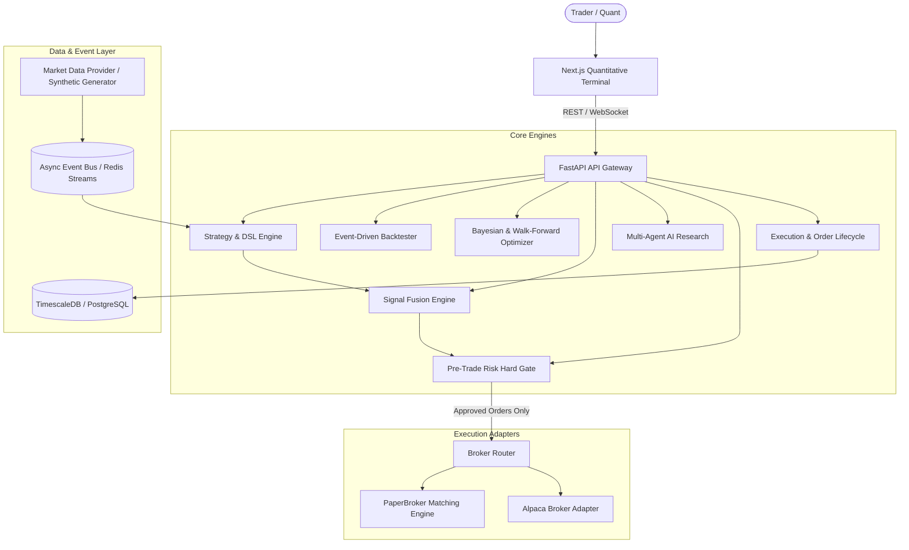

# QUANTARA System Architecture

Quantara is an institutional-grade, event-driven quantitative trading, AI research, and execution platform.

## High-Level Architecture Diagram

## Architectural Principles

1. **Deterministic Computation**: Given historical data and parameters, strategies and backtests always produce identical, reproducible results.
2. **Zero Look-Ahead Bias**: Event-driven backtester feeds bars chronologically one by one.
3. **Pre-Trade Risk Hard Gate**: AI agents cannot place orders directly. All orders must pass deterministic risk checks.
4. **Broker Abstraction**: Strategies execute identical logic across Backtest, Paper, and Live modes.
5. **Zero External Dependency Mode**: Fully functional with deterministic synthetic market data generator without requiring paid API keys.
